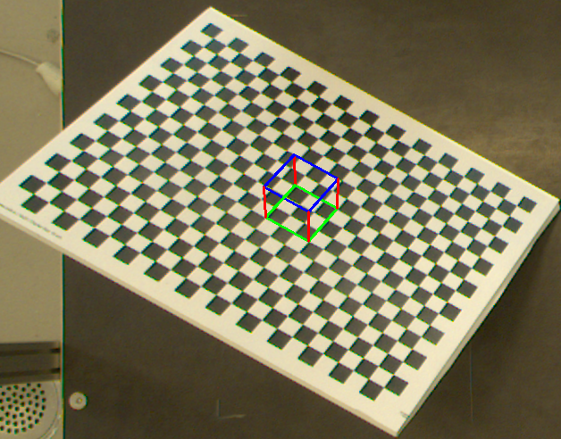
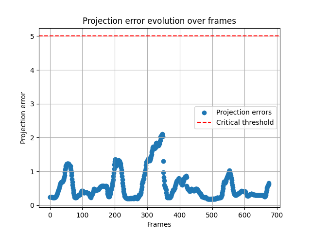
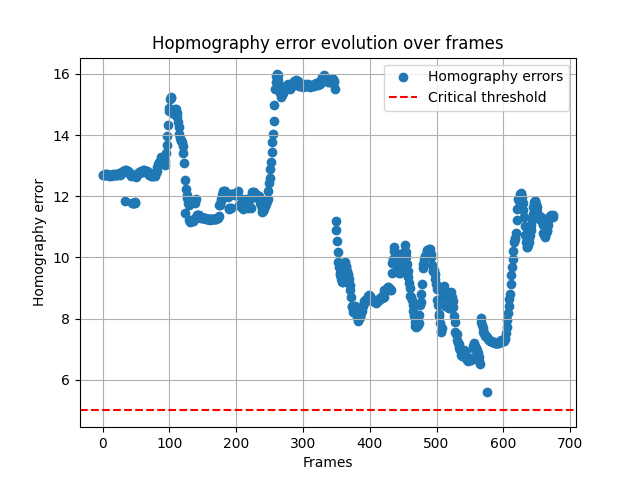

# 🔷 Computer Vision - Camera Calibration & Augmented Reality

## Overview

This project implements a complete computer vision pipeline for:

* Camera calibration using a chessboard pattern
* Homography estimation (manual + OpenCV comparison)
* Camera pose recovery (R, t)
* 3D cube projection onto images and videos

The goal is to evaluate both accuracy and robustness of classical geometric methods.

---

## Installation

Clone the repository:

```bash
git clone https://github.com/01alicia/homography-based-ar.git
cd homography-based-ar/
```

Create a virtual environment (recommended) and install dependencies:

```bash
python -m venv .venv
source .venv/bin/activate  # or .venv\Scripts\activate on Windows
pip install -r requirements.txt
```

---

## Usage

The project provides a command-line interface via `main.py`.

### Process an Image Set

```bash
python main.py --mode images --pattern 1
```

**Options:**

* `--pattern`: Select dataset pattern (default: 1)
* `--cube-size`: Size of the projected cube (default: 3)
* `--no-display`: Disable OpenCV window display

### Process a Video

```bash
python main.py --mode video --pattern 2
```

**Options:**

* `--pattern`: Video pattern identifier
* `--cube-size`: Cube size
* `--frame-step`: Number of skipped frames (default: 2)
* `--no-display`: Disable visualization

---

## Data Organization

### Input Data

```text
data/
├── images/
│   └── pattern1/
│       └── input/
│           ├── image1.png
│           └── ...
└── videos/
    └── pattern2/
        └── input.avi
```

### Output Results

```text
outputs/
├── images/
│   └── pattern1/
│       ├── frame_000.png
│       └── stats/
│           ├── projection.png
│           └── homography.png
└── videos/
    └── pattern2/
        ├── output.mp4
        └── stats/
            ├── projection.png
            └── homography.png
```

---

## Key Concepts

**Camera Projection Model**

The relationship between 3D world points and their 2D image projections is given by:

$$x=K[R∣t]X$$

Where:

* $K$: intrinsic matrix
* $R,t$: camera pose
* $X$: 3D point
* $x$: projected 2D point

--- 

## Features

* Camera calibration from images and videos
* Manual homography estimation (SVD-based)
* Comparison with OpenCV (cv2.findHomography)
* Pose estimation from homography
* 3D cube projection
* Quantitative evaluation:
  * Projection error
  * Homography error

--- 

## Pipeline

1. Detect chessboard corners
2. Calibrate camera → intrinsic parameters
3. Estimate homography:
   * Custom implementation (SVD)
   * OpenCV baseline
4. Recover pose (R, t)
5. Project 3D cube 
6. Compute errors

---

## Project Structure
```text
src/
    calibration.py
    homography.py
    metrics.py
    pipeline.py
    projection.py
```

---

## Data

This project uses external datasets:

- Image sets:
  - https://github.com/niconielsen32/ComputerVision/tree/master/cameraCalibration/calibration
  - https://www.me.psu.edu/brennan/ME545/2012/FinalProjects/Mangus_3DCameraCalibration/Calibration_Images.html

- Videos:
  - https://www.youtube.com/watch?v=yMsH9iJ0gy8
  - https://github.com/smidm/video2calibration/blob/master/example_input/chessboard.avi
  - https://www.youtube.com/watch?v=ATguafqLF4g

Datasets are not included in the repository due to size constraints.
Please download them manually and place them in the following structure:

```text
data/
├── images/
└── videos/
```

---

## Report / Documentation

Full technical report (methods, experiments, and analysis):

👉 [Read the report](docs/report.pdf)

Full API documentation is available online:

👉 https://01alicia.github.io/homography-based-ar/

---

## Results

### Example Projection



### Projection Error (Video)



### Homography Error



---

The system achieves:

- Stable projections under good calibration
- Low projection error (< 2 pixels) on videos
- Sensitivity to lighting, distortion, and resolution

---

## Metrics

### Projection Error

Measures the difference between:

* Custom projection
* OpenCV cv2.projectPoints

Unit: pixels

### Homography Error

Computed as relative RMSE between:

* Custom homography
* OpenCV homography

---

## Tips
* Use high-resolution images for better calibration
* Ensure good lighting conditions
* Avoid motion blur in videos
* Use multiple viewpoints for calibration

---

## Troubleshooting

### No images found

Check:

* file format (.png vs .jpg)
* correct folder structure

### Video not found

Ensure:

```bash
data/videos/patternX/input.<format>
```

### Poor projection results

Possible causes:

* inaccurate calibration
* bad corner detection
* distorted input images

---

## References

* OpenCV Camera Calibration docs
* Multiple datasets (YouTube + GitHub)

---

## Future Improvements
* Bundle adjustment
* Temporal filtering (Kalman)
* Robust estimation (RANSAC)
* Better corner detection
